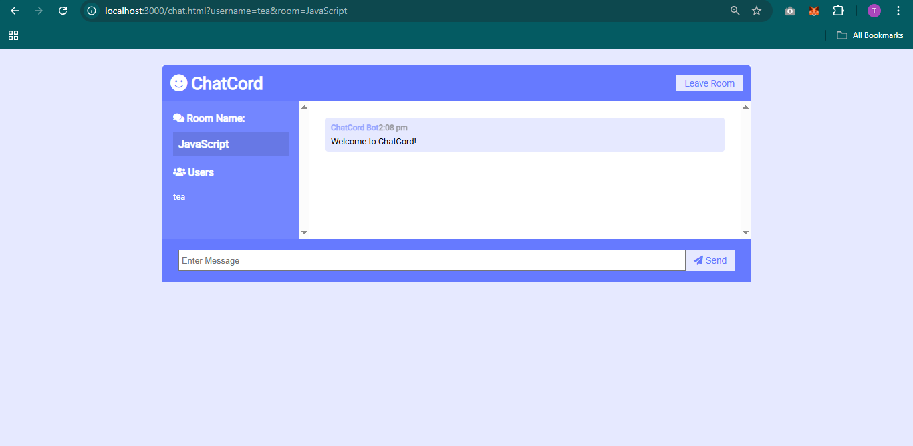

# Welcome to Chat Room! 👋

## About

> A real-time chat application built using **Node.js**, **Express**, **Socket.io**, and **Moment.js**.  
> It allows users to **join rooms with usernames** and chat with others in real time.  
> The app shows **timestamps**, **user join/leave notifications**, and supports **multiple rooms**.  
> The frontend uses **vanilla HTML, CSS, and JavaScript**, while the backend is powered by **Express & Socket.io**.

---

## 🚀 Live Demo

Check out the live project here:  
[Chat Room Live](#) *(add your deployment link)*  

---

## 📸 Screenshots  

### Landing / Join Page  
  

### Chat UI  
  

---

## 💻 Run Locally  

### Clone the repository  
```bash
git clone https://github.com/Tanukash12/Chat-Room-NodeJs-Redis.git

Go to the project directory

Install dependencies

```bash
  npm install
```
Run application

```bash
  npm run dev
```


Start the server

```bash
  npm run start
```


## Authors

- [@Tanukash12](https://github.com/Tanukash12)

## Features or Limitations

- Landing page for entering username & selecting chat room
- Real-time bi-directional communication using Socket.io
- Chat messages with timestamps using Moment.js
- User join/leave notifications
- Multiple chat rooms support
- Lightweight Express backend

